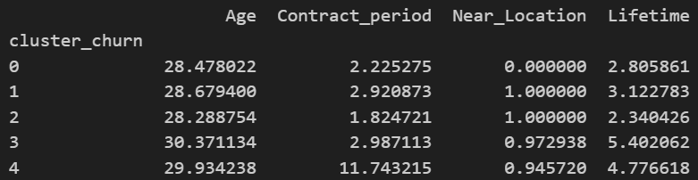

# 📊 Clientes Fitness

## 📌 Resumen
Entrene el modelo predictivo certero que ayudo a determinar cuales son los clientes mas redituable para los gimnasios, con una precision de 92 puntos, utilizando pandas, seaborn, matplot.lib,  sklearn.preprocessing, sklearn.ensemble, sklearn.metrics  y scipy.cluster.hierarchy.

## 🎯 Objeto de Estudio
Uno de los problemas más comunes que enfrentan los gimnasios y otros servicios es la pérdida de clientes. ¿Cómo descubres si un/a cliente ya no está contigo? Puedes calcular la pérdida en función de las personas que se deshacen de sus cuentas o no renuevan sus contratos. Sin embargo, a veces no es obvio que un/a cliente se haya ido, por lo que se busca detectar a los clientes que se proximos en retirarse y los clientes que tienden a permanecer.

## 📂 Dataset
Datos simulados / proporcionados con fines academicos que representan metricas operativas del sector. 
Los archivos están incluidos en la carpeta data/ para facilitar la reproducibilidad del análisis.

## 🧠 Metodologia
1. Importamos datos
2. Limpieza de datos 
    - Imprimimos una porcion de los datos y su informacion 
    - Analisamos los errores de formato y datos faltantes
    - Limpiamos, borramos y llenamos los datos 
3. Analisis de datos
    - Dividimos los datos en los clientes que se fueron y permanecieron 
    - Comparamos 
4. Aplicamos modelos de prediccion regresión logística, bosque aleatorio.
    - Evaluamos su indicadores de eficiencia 
5. Conclusiones.     

## 📈 Resultados
\
Los clusters con mejor retencion son el 2 y el 3 los cuales cuentan con mas del 90% de retencion, ademas de contar con la clientela que gasta mas dinero en servicios adicionales.

## ✅ Conclusiones
- Son clientes mayores de 29 años de edad (pueden poseer mas estabilidad economica)
- Cuentan con contratos de 3 a 12 meses( esto puede generar mas compromiso al pagar un plan mas amplio)
-  Suelen vivir cerca de establecimiento

## 🛠️ Herramientas Utilizadas
- Python 3.10
- Pandas 
- Seaborn
- Matplot.lib
- Sklearn.preprocessing
- Sklearn.ensemble
- Sklearn.metrics  
- Scipy.cluster.hierarchy.

## ▶️ Cómo Ejecutar el Proyecto**
1. Clonar el repositorio.
2. Crear el entorno virtual
    - Instalar el archivo requirements.txt
    - Activar el entorno virtual
3. Ejecutar el Notebook.
